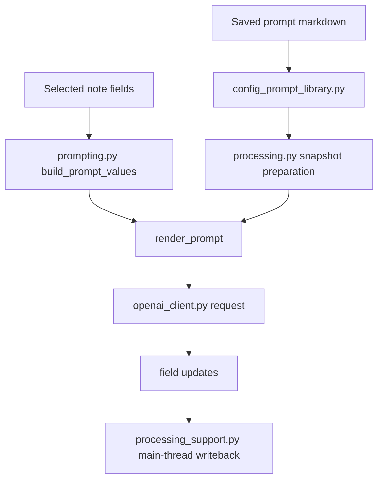

# Prompt Construction

This page used to describe the structured audit prompt path. The current add-on no longer has that audit-specific flow.

The active prompt construction path is now the shared field-update flow used by:

- Browser `Transform with AI`
- field-update workflows
- group runs that include field-update workflows

## Pieces Involved

- Saved prompt markdown:
  - [`prompt_library/default_prompts`](../../prompt_library/default_prompts)
  - [`prompt_library/user_prompts`](../../prompt_library/user_prompts)
- Prompt discovery and path resolution:
  - [`core/config_prompt_library.py`](../../core/config_prompt_library.py)
- Placeholder extraction and rendering:
  - [`core/prompting.py`](../../core/prompting.py)
- Processing orchestration:
  - [`core/processing.py`](../../core/processing.py)
- Request execution:
  - [`services/openai_client.py`](../../services/openai_client.py)

## Mermaid Diagram

Related files:

- [`core/config_prompt_library.py`](../../core/config_prompt_library.py)
- [`core/prompting.py`](../../core/prompting.py)
- [`core/processing.py`](../../core/processing.py)
- [`core/processing_support.py`](../../core/processing_support.py)
- [`services/openai_client.py`](../../services/openai_client.py)

## 1. Prompt Text Comes From Markdown Files

Saved prompts are discovered recursively from the prompt library folders.

- shipped prompts live under [`prompt_library/default_prompts`](../../prompt_library/default_prompts)
- user prompts live under [`prompt_library/user_prompts`](../../prompt_library/user_prompts)

The prompt library picker can therefore use nested folders without flattening everything into one dropdown list.

## 2. Placeholders Are Extracted Before Sending

Before a request is sent:

- placeholders are extracted from the prompt text
- placeholders are checked against the note's actual fields
- missing note fields are reported before any API request is made

Literal cloze examples like `{{c1::...}}` are intentionally ignored during placeholder extraction so they stay usable inside prompts.

## 3. Prompt Values Are Built From Note Data

[`core/prompting.py`](../../core/prompting.py) builds the render context from note fields.

That includes:

- direct field substitution such as `{{Expression}}`
- optional `{{NoteType}}`
- HTML stripping for selected fields before prompt rendering

## 4. The Final Request Is Built In `processing.py`

For each note snapshot, the processing layer:

1. chooses the effective prompt and system prompt
2. renders the final user prompt
3. sends either:
   - a structured field-update request for single-target workflows
   - a plain text request for multi-field delimited output mode

## 5. Returned Content Is Parsed And Applied

After the model returns:

- single-target field updates are applied directly
- multi-field delimited output is parsed by [`processing_text.py`](../../core/processing_text.py)
- note writes are applied on the main thread through [`processing_support.py`](../../core/processing_support.py)

This keeps prompt rendering, request execution, response parsing, and writeback separate enough to maintain without reintroducing a special audit-only path.
