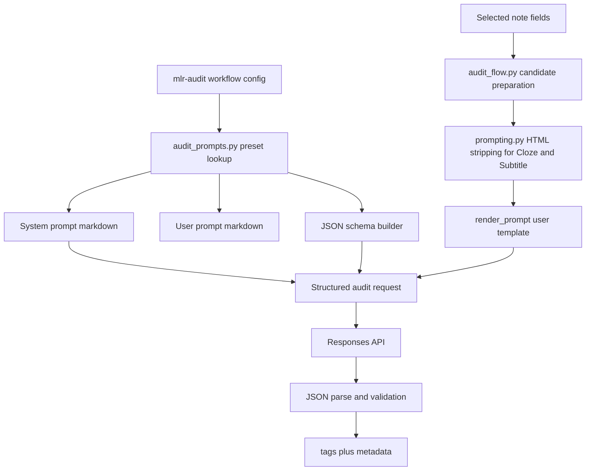

# Audit Prompt Construction

This note explains how an `audit` workflow turns note data into the final OpenAI request.

The short version:

- the prompt text lives in the prompt library
- the schema preset lives in Python
- the note fields are normalized before rendering
- `audit_flow.py` combines all of that into one structured Responses API request

## Pieces Involved

- System prompt text:
  - [`prompt_library/system_prompts/mlr-audit-system.md`](../../prompt_library/system_prompts/mlr-audit-system.md)
- User prompt template:
  - [`prompt_library/default_prompts/mlr-audit.md`](../../prompt_library/default_prompts/mlr-audit.md)
- Audit preset registry and JSON schema:
  - [`core/audit_prompts.py`](../../core/audit_prompts.py)
- Audit execution:
  - [`core/audit_flow.py`](../../core/audit_flow.py)
- Shared prompt rendering and HTML stripping:
  - [`core/prompting.py`](../../core/prompting.py)

## Mermaid Diagram

Related files:

- [`core/audit_prompts.py`](../../core/audit_prompts.py)
- [`core/audit_flow.py`](../../core/audit_flow.py)
- [`core/prompting.py`](../../core/prompting.py)
- [`prompt_library/system_prompts/mlr-audit-system.md`](../../prompt_library/system_prompts/mlr-audit-system.md)
- [`prompt_library/default_prompts/mlr-audit.md`](../../prompt_library/default_prompts/mlr-audit.md)

## 1. Workflow Config Chooses The Audit Preset

The visible `mlr-audit` workflow is still just a workflow config entry.

What makes it special is:

- `workflow_type = "audit"`
- a schema preset such as `mlr_audit`
- optional prompt/model overrides

At execution time, [`execute_audit_workflow()`](../../core/audit_flow.py) loads the workflow and asks [`get_audit_schema_preset()`](../../core/audit_prompts.py) for the matching preset.

That preset defines:

- relevant note fields
- allowed audit statuses
- allowed severities
- allowed issue fields
- allowed fields to update later
- default system prompt text
- default user prompt template
- the JSON schema builder

## 2. Prompt Text Comes From Markdown Files

The actual audit prompt wording does not live inline in the workflow config parser.

Instead:

- [`mlr-audit-system.md`](../../prompt_library/system_prompts/mlr-audit-system.md) contains the audit system prompt
- [`mlr-audit.md`](../../prompt_library/default_prompts/mlr-audit.md) contains the user prompt template with placeholders like `{{Cloze}}` and `{{Subtitle}}`

[`core/audit_prompts.py`](../../core/audit_prompts.py) loads those files once and exposes them as the preset defaults.

That means the prompt content is easy to edit, while the response contract still stays in code.

## 3. The Schema Is Added Separately

The audit request is not just a plain prompt.

It is:

- system prompt text
- rendered user prompt text
- schema name
- JSON schema

The schema currently comes from [`mlr_audit_response_schema()`](../../core/audit_prompts.py).

That schema defines the exact structured output shape, including:

- `status`
- `confidence`
- `is_learnworthy`
- `auto_fix_allowed`
- `summary`
- `issues`
- `fields_to_update`
- `recommended_tags`

So the prompt tells the model what to evaluate, and the schema tells it how it must answer.

## 4. Note Fields Are Normalized Before Rendering

Before the user prompt is rendered, audit candidates are prepared in [`core/audit_flow.py`](../../core/audit_flow.py).

During that step:

- all relevant fields are collected from the note
- `Cloze` is stripped down to plain text
- `Subtitle` is also stripped down to plain text

The stripping logic now uses the shared helper in [`core/prompting.py`](../../core/prompting.py), so the same sanitation rule is consistent across audit and normal generation flows.

The current normalization removes:

- HTML tags
- `<script>` and `<style>` blocks
- HTML entities
- extra spacing/noisy line breaks

This keeps HTML-heavy note content from leaking into the audit prompt.

## 5. The Final Request Is Built In `audit_flow.py`

Inside [`_run_audit()`](../../core/audit_flow.py), the add-on builds the final request like this:

1. load the chosen workflow and preset
2. choose the effective system prompt
3. choose the effective user prompt template
4. render the user prompt with the normalized note fields
5. send the request through the structured Responses API helper

Conceptually the request looks like:

- `system_prompt = audit system prompt`
- `user_prompt = rendered audit template with note fields`
- `schema_name = <workflow-specific schema id>`
- `schema = preset JSON schema`

## 6. The Model Output Is Validated Before Use

After the response comes back:

1. the output text is parsed as JSON
2. the JSON is validated against the audit contract
3. only normalized validated values are used for:
   - audit tags
   - audit metadata fields
   - audit log storage

So the source of truth is not the raw model text. It is the validated parsed audit result.

## Why This Is Split Across Markdown And Python

This split is intentional:

- Markdown files are good for prompt wording
- Python is better for schema and validation rules

If everything lived in Markdown only, the prompt would be editable but the execution contract would become much harder to validate and evolve safely.

If everything lived in Python only, the prompt wording would be less discoverable and harder to iterate on.

The current design keeps:

- prompt content editable
- schema/validation explicit
- request construction predictable
