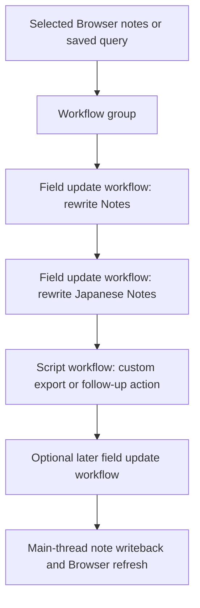

# Sample Workflow Group With Script Step

This page used to document the old audit pipeline. The current add-on no longer has pipelines or the structured audit JSON flow.

The closest current architecture example is a workflow group that mixes prompt-driven field updates with a visible custom script step.

## What This Group Does

A typical current group can:

1. select notes through a Browser selection or a saved query
2. run one or more field-update workflows in order
3. run a custom script step after or between those workflows
4. refresh note content in the Browser when the sequence finishes

## Mermaid Diagram



Related files:

- [`ui/browser_menu.py`](../../ui/browser_menu.py)
- [`ui/workflow.py`](../../ui/workflow.py)
- [`ui/workflow_dialog.py`](../../ui/workflow_dialog.py)
- [`core/workflow_engine.py`](../../core/workflow_engine.py)
- [`core/processing.py`](../../core/processing.py)

## Example Shape

Conceptually, the group looks like this:

```json
{
  "group": "MLR",
  "workflows": [
    {
      "type": "field_update",
      "name": "MLR Japanese Notes Easy"
    },
    {
      "type": "field_update",
      "name": "MLR Grammar"
    },
    {
      "type": "script",
      "name": "Post-process export",
      "script_command": "./scripts/export-results.sh"
    }
  ]
}
```

## Why This Replaced The Older Pipeline Shape

The current setup is simpler because:

- execution order stays visible in the workflow list
- custom scripts are no longer hidden behind special group settings
- Browser-selected note runs and query-based runs use the same workflow engine
- there is one orchestration layer instead of a second pipeline system above it

## Current Good Practice

- Keep field-update workflows atomic.
- Use groups only for ordering and organization.
- Use script workflows only when the action is genuinely outside the normal prompt-to-field flow.
- Prefer Browser-selected runs when the workflow does not need a saved query.
