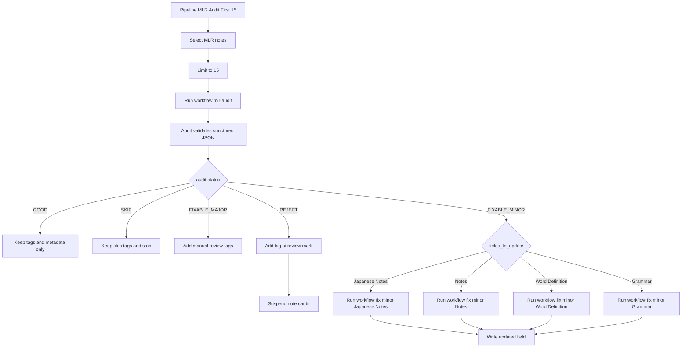

# Sample User Audit Pipeline

This document shows a concrete example of the current user-facing audit pipeline for `Moritz Language Reactor` notes.

It is based on the current seeded setup:

- workflow: `mlr-audit`
- pipeline: `pipeline-mlr-audit-first-15`

## What This Pipeline Does

The sample pipeline:

1. selects `Moritz Language Reactor` notes
2. excludes already suspended or buried notes
3. limits the selection to 15 notes
4. runs the `mlr-audit` workflow on those notes
5. branches per note based on the validated audit result
6. runs field-specific follow-up workflows only when `FIXABLE_MINOR` notes explicitly request those fields
7. tags rejected notes with `ai::review::mark` and suspends their cards

## Mermaid Diagram



Related files:

- [`config.json`](../../config.json)
- [`meta.json`](../../meta.json)
- [`core/config.py`](../../core/config.py)
- [`core/workflow_engine.py`](../../core/workflow_engine.py)
- [`core/audit_prompts.py`](../../core/audit_prompts.py)
- [`core/audit_flow.py`](../../core/audit_flow.py)
- [`prompt_library/system_prompts/mlr-audit-system.md`](../../prompt_library/system_prompts/mlr-audit-system.md)
- [`prompt_library/user_prompts/mlr-audit.md`](../../prompt_library/user_prompts/mlr-audit.md)
- [`user_data/audit_log.json`](../../user_data/audit_log.json)

## Current Example Workflow

The `mlr-audit` workflow is an atomic audit workflow.

Conceptually it is configured like this:

```json
{
  "id": "mlr-audit",
  "name": "MLR Audit",
  "query": "note:\"Moritz Language Reactor\" is:new -is:suspended -is:buried limit:15",
  "workflow_type": "audit",
  "enabled": true,
  "prompt_id": "mlr-audit-prompt",
  "system_prompt_id": "mlr-audit-system",
  "model": "gpt-5-mini",
  "api_mode": "responses",
  "schema_preset": "mlr_audit",
  "note_type_filter": "Moritz Language Reactor",
  "clear_status_tags": [
    "ai::audit::good",
    "ai::audit::fix_minor",
    "ai::audit::fix_major",
    "ai::audit::reject",
    "ai::audit::skip"
  ],
  "status_tag_map": {
    "GOOD": "ai::audit::good",
    "FIXABLE_MINOR": "ai::audit::fix_minor",
    "FIXABLE_MAJOR": "ai::audit::fix_major",
    "REJECT": "ai::audit::reject",
    "SKIP": "ai::audit::skip"
  },
  "extra_status_tags": {
    "FIXABLE_MAJOR": ["ai::review::manual"],
    "REJECT": ["ai::review::manual"]
  },
  "success_tags": ["ai::audit::checked", "ai::audit::processed"],
  "failure_tags": ["ai::audit::failed", "ai::audit::processed"],
  "metadata_field_map": {
    "status": "AI Audit Status",
    "summary": "AI Audit Summary",
    "confidence": "AI Audit Confidence",
    "fields_to_update": "AI Fields To Update",
    "last_checked": "AI Last Checked",
    "raw": "AI Audit Raw"
  },
  "store_raw_output": true
}
```

## Current Example Pipeline

The current seeded pipeline now does the whole first-pass audit-and-follow-up flow:

```json
{
  "id": "pipeline-mlr-audit-first-15",
  "name": "MLR Audit First 15",
  "enabled": true,
  "note_selector": {
    "query": "note:\"Moritz Language Reactor\" is:new -is:suspended -is:buried",
    "limit": 15
  },
  "steps": [
    {
      "id": "audit",
      "type": "run_workflow",
      "workflow_id": "mlr-audit"
    },
    {
      "id": "fix-japanese-notes",
      "type": "run_workflow",
      "workflow_id": "workflow-mlr-fix-minor-japanese-notes",
      "when": {
        "all": [
          { "artifact_equals": ["audit.status", "FIXABLE_MINOR"] },
          { "artifact_equals": ["audit.auto_fix_allowed", true] },
          { "artifact_contains": ["audit.fields_to_update", "Japanese Notes"] }
        ]
      }
    },
    {
      "id": "fix-notes",
      "type": "run_workflow",
      "workflow_id": "workflow-mlr-fix-minor-notes",
      "when": {
        "all": [
          { "artifact_equals": ["audit.status", "FIXABLE_MINOR"] },
          { "artifact_equals": ["audit.auto_fix_allowed", true] },
          { "artifact_contains": ["audit.fields_to_update", "Notes"] }
        ]
      }
    },
    {
      "id": "fix-word-definition",
      "type": "run_workflow",
      "workflow_id": "workflow-mlr-fix-minor-word-definition",
      "when": {
        "all": [
          { "artifact_equals": ["audit.status", "FIXABLE_MINOR"] },
          { "artifact_equals": ["audit.auto_fix_allowed", true] },
          { "artifact_contains": ["audit.fields_to_update", "Word Definition"] }
        ]
      }
    },
    {
      "id": "fix-grammar",
      "type": "run_workflow",
      "workflow_id": "workflow-mlr-fix-minor-grammar",
      "when": {
        "all": [
          { "artifact_equals": ["audit.status", "FIXABLE_MINOR"] },
          { "artifact_equals": ["audit.auto_fix_allowed", true] },
          { "artifact_contains": ["audit.fields_to_update", "Grammar"] }
        ]
      }
    },
    {
      "id": "mark-reject",
      "type": "tag",
      "add_tags": ["ai::review::mark"],
      "when": { "artifact_equals": ["audit.status", "REJECT"] }
    },
    {
      "id": "suspend-reject",
      "type": "suspend_cards",
      "when": { "artifact_equals": ["audit.status", "REJECT"] }
    }
  ]
}
```

## Why This Is a Good User Pipeline

This example is a good starting point because it is:

- easy to understand
- safe to run repeatedly
- limited in scope
- still driven by atomic workflows
- branched only on validated audit data
- able to complete the first follow-up pass in one run

The audit workflow does the structured classification work.
The follow-up workflows do one field update each.
The pipeline only selects notes and orchestrates execution.

## What Gets Written

The audit workflow itself does not rewrite fields like:

- `Cloze`
- `Lemma`
- `Subtitle`
- `Word Definition`
- `Japanese Notes`
- `Notes`
- `Grammar`

Instead it writes:

- status/process tags such as `ai::audit::good`, `ai::audit::fix_minor`, `ai::audit::processed`
- audit metadata in optional note fields if they exist
- audit entries in `user_data/audit_log.json`

The follow-up workflows may then rewrite only the support fields explicitly listed in `fields_to_update`:

- `Japanese Notes`
- `Notes`
- `Word Definition`
- `Grammar`

## Supporting Workflows

The current seeded follow-up workflows are:

- `workflow-mlr-fix-minor-japanese-notes`
- `workflow-mlr-fix-minor-notes`
- `workflow-mlr-fix-minor-word-definition`
- `workflow-mlr-fix-minor-grammar`

Each one stays atomic:

- one prompt
- one field-focused task
- independently runnable outside the pipeline if needed

## Implementation Notes

- The audit step strips HTML from `Cloze` before rendering the audit prompt.
- The pipeline uses `artifact_contains` so list-valued audit output like `fields_to_update` can drive branching.
- Rejected notes get tag `ai::review::mark`, then the cards that belong to those notes are suspended.
- `FIXABLE_MAJOR` currently stays in the audit/tagging lane and does not auto-rewrite fields.

## Mermaid For The Standalone Preview

The same diagram also exists as a standalone Mermaid source file:

- [`sample-user-workflow-pipeline.mmd`](./sample-user-workflow-pipeline.mmd)

## Notes

- The workflow query and the pipeline note selector both currently encode the same initial note scope for convenience.
- Same-day skip behavior is enforced from stored audit metadata, not from a date-like persistent tag.
- The sample workflow query uses `limit:15`. That works when the separate `limit-search-results` add-on is installed.
- The workflow also includes its own query, but when called from a pipeline the pipeline is the orchestration layer and provides the note set.
- The audit workflow currently uses the Responses API because it needs structured output validation.
