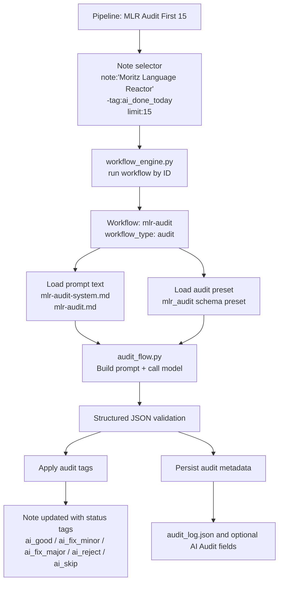
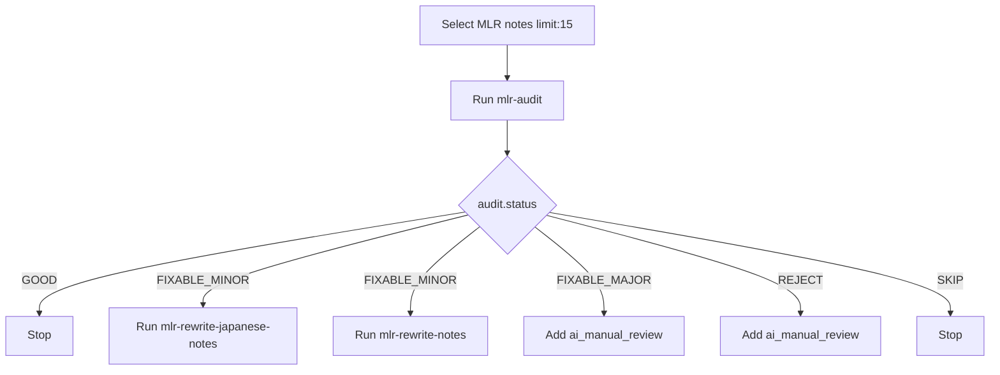

# Sample User Audit Pipeline

This document shows a concrete example of a user-facing audit pipeline for `Moritz Language Reactor` notes.

It is based on the current seeded setup:

- workflow: `mlr-audit`
- pipeline: `pipeline-mlr-audit-first-15`

## What This Pipeline Does

The sample pipeline:

1. selects `Moritz Language Reactor` notes
2. excludes notes already tagged `ai_done_today`
3. limits the selection to 15 notes
4. runs the `mlr-audit` workflow on those notes
5. lets the audit workflow apply tags and store audit metadata

This is intentionally diagnostic-only. It does not rewrite learning content fields.

## Mermaid Diagram



Related files:

- [`config.json`](../../config.json)
- [`meta.json`](../../meta.json)
- [`core/config.py`](../../core/config.py)
- [`core/workflow_engine.py`](../../core/workflow_engine.py)
- [`core/audit_prompts.py`](../../core/audit_prompts.py)
- [`core/audit_flow.py`](../../core/audit_flow.py)
- [`prompt_library/system_prompts/mlr-audit-system.md`](../../prompt_library/system_prompts/mlr-audit-system.md)
- [`prompt_library/user_prompts/mlr-audit.md`](../../prompt_library/user_prompts/mlr-audit.md)
- [`user_data/audit_log.json`](../../user_data/audit_log.json)

## Current Example Workflow

The `mlr-audit` workflow is an atomic audit workflow.

Conceptually it is configured like this:

```json
{
  "id": "mlr-audit",
  "name": "MLR Audit",
  "query": "note:\"Moritz Language Reactor\" -tag:ai_done_today limit:15",
  "workflow_type": "audit",
  "enabled": true,
  "prompt_id": "mlr-audit-prompt",
  "system_prompt_id": "mlr-audit-system",
  "model": "gpt-5-mini",
  "api_mode": "responses",
  "schema_preset": "mlr_audit",
  "note_type_filter": "Moritz Language Reactor",
  "clear_status_tags": [
    "ai_good",
    "ai_fix_minor",
    "ai_fix_major",
    "ai_reject",
    "ai_skip"
  ],
  "status_tag_map": {
    "GOOD": "ai_good",
    "FIXABLE_MINOR": "ai_fix_minor",
    "FIXABLE_MAJOR": "ai_fix_major",
    "REJECT": "ai_reject",
    "SKIP": "ai_skip"
  },
  "extra_status_tags": {
    "FIXABLE_MAJOR": ["ai_manual_review"],
    "REJECT": ["ai_manual_review"]
  },
  "success_tags": ["ai_checked", "ai_done_today"],
  "failure_tags": ["ai_audit_failed", "ai_done_today"],
  "metadata_field_map": {
    "status": "AI Audit Status",
    "summary": "AI Audit Summary",
    "confidence": "AI Audit Confidence",
    "fields_to_update": "AI Fields To Update",
    "last_checked": "AI Last Checked",
    "raw": "AI Audit Raw"
  },
  "store_raw_output": true
}
```

## Current Example Pipeline

The pipeline is intentionally simple:

```json
{
  "id": "pipeline-mlr-audit-first-15",
  "name": "MLR Audit First 15",
  "enabled": true,
  "note_selector": {
    "query": "note:\"Moritz Language Reactor\" -tag:ai_done_today limit:15"
  },
  "steps": [
    {
      "id": "audit",
      "type": "run_workflow",
      "workflow_id": "mlr-audit"
    }
  ]
}
```

## Why This Is a Good First User Pipeline

This example is a good starting point because it is:

- easy to understand
- safe to run repeatedly
- diagnostic-only
- limited in scope
- already compatible with later branching

The workflow does the structured audit work.
The pipeline only selects notes and orchestrates execution.

## What Gets Written

The audit workflow does not rewrite fields like:

- `Cloze`
- `Lemma`
- `Subtitle`
- `Word Definition`
- `Japanese Notes`
- `Notes`
- `Grammar`

Instead it writes:

- status/process tags such as `ai_good`, `ai_fix_minor`, `ai_done_today`
- audit metadata in optional note fields if they exist
- audit entries in `user_data/audit_log.json`

## How This Could Grow Later

A later version could branch after the audit step.

For example:



Related files for the future branching example:

- [`config.json`](../../config.json)
- [`core/pipelines.py`](../../core/pipelines.py)
- [`core/workflow_engine.py`](../../core/workflow_engine.py)

That future version would still keep the same architecture:

- audit remains an atomic workflow
- rewrite steps remain atomic workflows
- the pipeline handles branching

## Notes

- The sample query uses `limit:15`. That works when the separate `limit-search-results` add-on is installed.
- The workflow also includes its own query, but when called from a pipeline the pipeline is the orchestration layer and provides the note set.
- The audit workflow currently uses the Responses API because it needs structured output validation.
