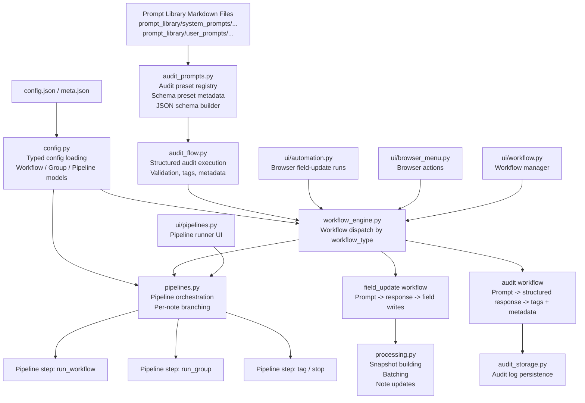

# Workflows, Groups, and Pipelines

This note explains the three-layer execution model in AI Automation and where the audit flow fits into it.

## Summary

- Workflows are atomic executable units.
- Groups are organizational collections of workflows.
- Pipelines are the orchestration layer that selects notes and chains workflows or groups conditionally.

The important design rule is that these three concepts stay separate:

- A workflow should do one thing.
- A group should organize workflows, not contain branching logic.
- A pipeline should coordinate execution, not reimplement workflow behavior.

## Mermaid Diagram

Related files:

- [`prompt_library/README.md`](../../prompt_library/README.md)
- [`core/audit_prompts.py`](../../core/audit_prompts.py)
- [`core/config.py`](../../core/config.py)
- [`core/audit_flow.py`](../../core/audit_flow.py)
- [`core/workflow_engine.py`](../../core/workflow_engine.py)
- [`core/pipelines.py`](../../core/pipelines.py)
- [`core/processing.py`](../../core/processing.py)
- [`core/audit_storage.py`](../../core/audit_storage.py)
- [`ui/automation.py`](../../ui/automation.py)
- [`ui/browser_menu.py`](../../ui/browser_menu.py)
- [`ui/workflow.py`](../../ui/workflow.py)
- [`ui/pipelines.py`](../../ui/pipelines.py)

## Layer Responsibilities

### 1. Workflows

Workflows are atomic executable units stored in config and dispatched by [`workflow_engine.py`](../../core/workflow_engine.py).

Current workflow types:

- `field_update`
- `audit`

Examples:

- `mlr-rewrite-japanese-notes`
- `mlr-rewrite-notes`
- `mlr-audit`

Key files:

- [`config.py`](../../core/config.py)
- [`workflow_engine.py`](../../core/workflow_engine.py)
- [`processing.py`](../../core/processing.py)
- [`audit_flow.py`](../../core/audit_flow.py)

### 2. Groups

Groups are only for organization and manual bulk execution.

They:

- collect related workflow IDs indirectly through workflow membership
- help filter the workflow list
- allow “run this group” actions in sequence

They do not:

- branch
- evaluate conditions
- contain pipeline state

Key file:

- [`config.py`](../../core/config.py)

### 3. Pipelines

Pipelines are the orchestration layer above workflows and groups.

They:

- select a note set once
- build a per-note execution context
- run workflows or groups
- branch declaratively using conditions such as:
  - `artifact_equals`
  - `tag_present`
  - `field_empty`
  - `previous_step_succeeded`

Pipelines call workflows uniformly by workflow ID. They do not need to know whether a workflow is a field update or an audit workflow.

Key file:

- [`pipelines.py`](../../core/pipelines.py)

## Where Audit Fits

Audit is a real workflow type, not a special pipeline-only path.

That means:

- `mlr-audit` is a normal workflow config entry
- the workflow manager can list it
- the Browser can run it as a workflow shortcut
- pipelines can reference it with `run_workflow`

The audit workflow itself still has a richer contract than a field update workflow:

- it requests structured output
- it validates the result against a schema preset
- it derives tags from normalized status values
- it persists audit metadata

Prompt text for the audit preset now lives in:

- [`mlr-audit-system.md`](../../prompt_library/system_prompts/mlr-audit-system.md)
- [`mlr-audit.md`](../../prompt_library/user_prompts/mlr-audit.md)

Schema and validation metadata still live in:

- [`audit_prompts.py`](../../core/audit_prompts.py)

## Why `audit_prompts.py` Still Exists

`audit_prompts.py` is not the pipeline engine.

It exists because the audit system needs more than prompt text:

- allowed statuses
- allowed severities
- allowed issue fields
- allowed updatable fields
- JSON schema generation
- preset lookup

So the split is:

- Markdown files = prompt content
- Python preset registry = schema/validation contract

## Typical Execution Paths

### Browser field update

1. Browser action opens the run dialog.
2. A `field_update` workflow or manual run config is resolved.
3. [`workflow_engine.py`](../../core/workflow_engine.py) or [`processing.py`](../../core/processing.py) performs the field-writing flow.

### Browser audit

1. Browser action triggers `mlr-audit`.
2. [`workflow_engine.py`](../../core/workflow_engine.py) dispatches to audit execution.
3. [`audit_flow.py`](../../core/audit_flow.py) validates the structured result, applies tags, and stores metadata.

### Pipeline run

1. [`pipelines.py`](../../core/pipelines.py) selects notes from the configured query.
2. It creates one execution context per note.
3. Each step runs conditionally for matching notes.
4. Workflow execution is delegated to [`workflow_engine.py`](../../core/workflow_engine.py).
5. Artifacts from one step can be used by later pipeline conditions.

## Extension Points

Good future extensions:

- additional workflow types such as `local_action`
- more audit schema presets
- pipeline UI editing
- more declarative pipeline step types

Things intentionally avoided so far:

- turning groups into orchestration objects
- forcing audits into the field-update output model
- arbitrary user code execution in pipelines
