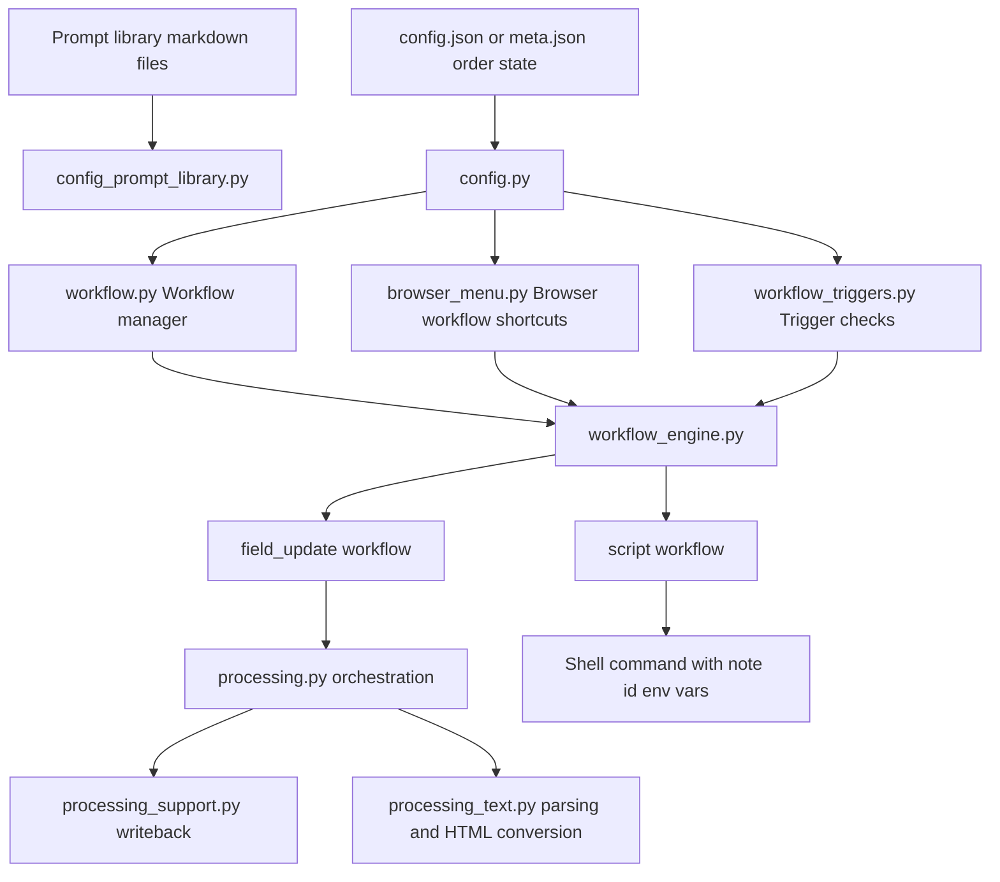

# Workflows, Groups, and Script Steps

This note describes the current execution model in AI Automation.

Historically the add-on also had pipelines and structured audit workflows. Those are no longer part of the active codepath. The current architecture is intentionally simpler:

- workflows are the executable units
- groups organize workflows
- script steps are just workflows of type `script`

## Summary

- A workflow should do one thing.
- A group should collect related workflows and define run order.
- A custom script should be visible as a workflow row instead of being hidden as a special group-only hook.

## Mermaid Diagram

Related files:

- [`core/config.py`](../../core/config.py)
- [`core/config_models.py`](../../core/config_models.py)
- [`core/config_parsing.py`](../../core/config_parsing.py)
- [`core/config_prompt_library.py`](../../core/config_prompt_library.py)
- [`core/workflow_engine.py`](../../core/workflow_engine.py)
- [`core/processing.py`](../../core/processing.py)
- [`ui/workflow.py`](../../ui/workflow.py)
- [`ui/workflow_dialog.py`](../../ui/workflow_dialog.py)
- [`ui/browser_menu.py`](../../ui/browser_menu.py)

## 1. Workflows

Workflows are atomic executable units stored as YAML-backed automation items.

Current workflow types:

- `field_update`
- `script`

### `field_update`

A field-update workflow:

- resolves a saved prompt
- renders the prompt against note fields
- calls the configured model
- writes returned content back into note fields

These workflows reuse the same lower-level processing stack as manual Browser runs.

### `script`

A script workflow:

- has no prompt requirement
- optionally uses a query like any other workflow
- can also run against Browser-selected note IDs
- executes exactly once at its position in the group/workflow order

The command currently receives:

- `AI_AUTOMATION_WORKFLOW_ID`
- `AI_AUTOMATION_WORKFLOW_NAME`
- `AI_AUTOMATION_WORKFLOW_TYPE`
- `AI_AUTOMATION_NOTE_IDS`

That keeps custom automation explicit while still letting the UI show where the script runs.

## 2. Groups

Groups are organizational containers for workflows.

They are used to:

- filter the workflow list
- run several workflows in order
- provide a Browser shortcut for running the same sequence on selected notes

Groups do not carry their own hidden execution hook anymore. If a group needs a script step, that script is added as a normal workflow row inside the group.

## 3. Browser-Selected Runs

The Browser menu can:

- open the manual `Transform with AI` dialog
- run one enabled workflow on the selected notes
- run one enabled group on the selected notes

That means a workflow query can now be empty if the workflow is mainly intended for Browser-selected notes.

## 4. Triggers

Workflow triggers still exist independently of Browser runs.

They:

- reload the active config
- evaluate each enabled workflow's saved query
- run eligible workflows when startup/periodic conditions are met

This keeps automatic execution in the workflow layer instead of reintroducing a separate pipeline layer.

## 5. Removed Architecture Pieces

The following are no longer part of the active architecture:

- audit workflow type
- structured audit JSON schema handling
- pipeline orchestration
- pipeline runner UI
- persisted audit log storage

The filenames of some architecture notes still reflect that older phase, but the active implementation no longer depends on those components.
